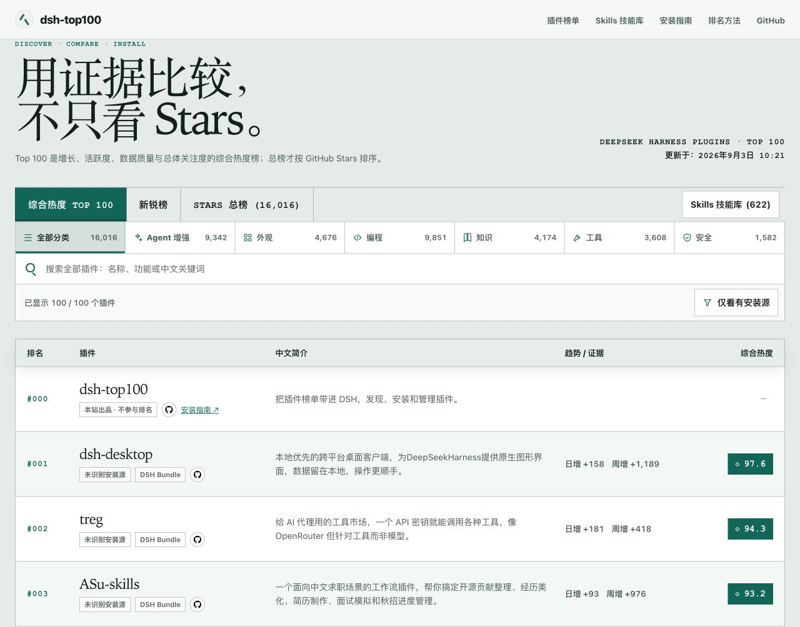
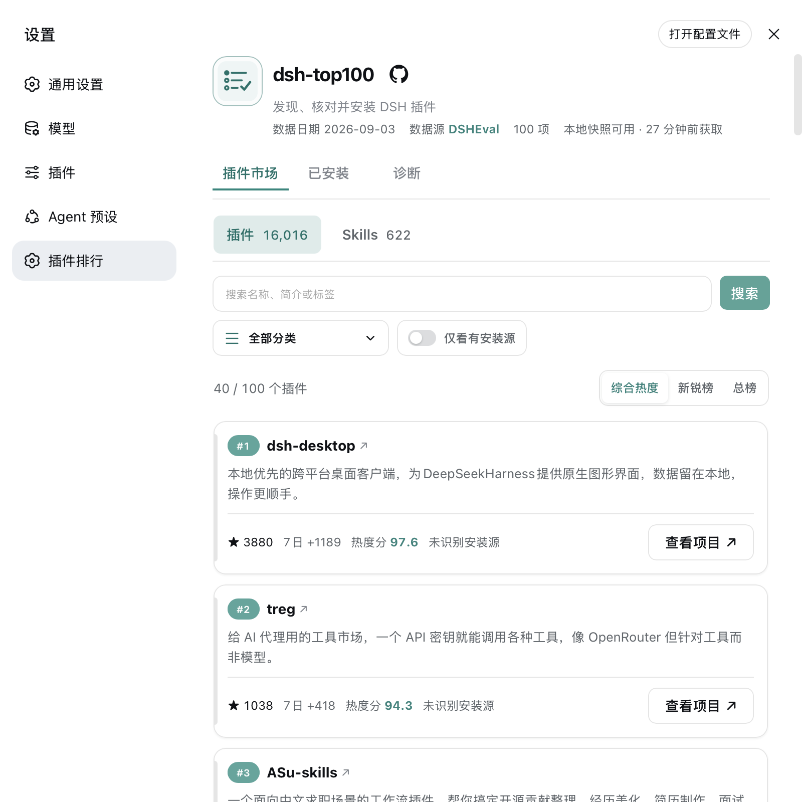
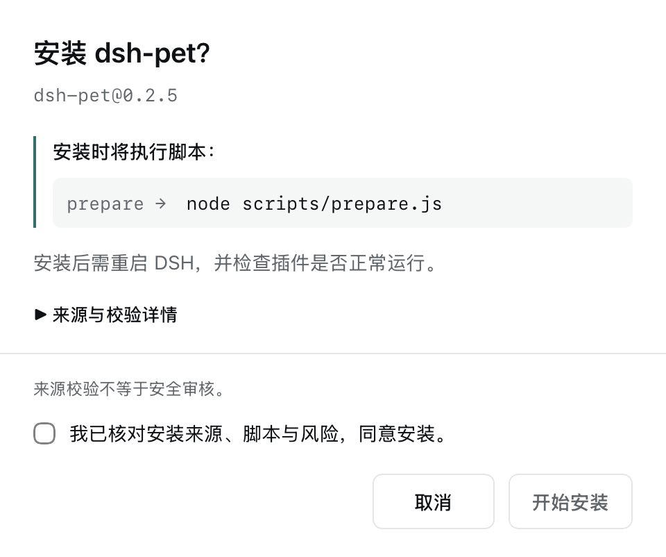

# dsh-top100

发现值得安装的 DeepSeek Harness 插件。

在官网浏览榜单，也可以把榜单带进 DSH，发现、安装和管理插件。综合热度、新锐榜和 Stars 总榜提供不同的比较视角；Skills 保持独立目录。

[访问官网](https://www.dsheval.ai/) · [安装指南](https://www.dsheval.ai/?page=dsh#dsh) · [npm 插件](https://www.npmjs.com/package/@dsheval/dsh-top100-plugin) · [提交插件](https://github.com/dsheval/dsh-top100/issues/new?labels=submission&title=%5BSubmit%5D%20owner%2Frepo) · [参与贡献](./CONTRIBUTING.md)

[](https://www.npmjs.com/package/@dsheval/dsh-top100-plugin)
[](https://github.com/dsheval/dsh-top100/actions/workflows/ci.yml)
[](./LICENSE)

## 可以做什么

- **发现插件**：查看中文简介、增长趋势和综合热度，按功能分类、关键词与安装来源筛选。
- **在 DSH 中安装和管理**：对已识别的安装源进行预检，核对来源、脚本与风险后确认安装；在设置页查看已安装项和诊断信息。
- **浏览 Skills**：使用独立技能库，不混入插件排名。
- **在对话中获取推荐**：自带 `recommend-dsh-plugins` Skill，通过 `dsh_top100_search` 查询榜单，为具体需求推荐插件。

## 界面预览

以下为 2026-09-03 本地开发版截图；界面与榜单数据会随版本和每日更新变化。

### 官网 · 浏览与筛选榜单

<a href="./web/public/assets/dsh-website-preview.jpg">
  
</a>

### DSH 插件 · 把榜单带进设置页

<a href="./web/public/assets/dsh-plugin-market.png">
  
</a>

<details>
<summary>查看安装确认界面</summary>

点击「安装」后，先核对精确安装源、将执行的脚本及风险，再确认本次操作。来源校验不等于安全审核。

<a href="./web/public/assets/dsh-install-confirm.png">
  
</a>

</details>

## 安装到 DSH

需要 **Node.js 22.13+** 和 **DSH Web 0.1.0-rc.6+**。普通 npm/npx 用户请在 DSH 源码目录外，依次运行：

```sh
npx @deepseek-ai/dsh plugin --profile web add @dsheval/dsh-top100-plugin
npx @deepseek-ai/dsh web
```

打开 DSH Web，进入 **设置 → 插件排行**。安装和启动必须使用同一种命令前缀；全局 CLI、源码运行及问题排查见 [安装指南](https://www.dsheval.ai/?page=dsh#dsh)。

这里只安装榜单插件，不会自动安装榜单中的其他项目。安装其他插件前，仍需核对来源、脚本与风险；安装后按提示重启 DSH 并检查运行状态。

插件与官网使用 DSHeval 发布的同一套榜单数据，无需自行运行 Collector 或数据库。插件功能与安装边界详见 [插件 README](./plugin/README.md)，版本变更见 [CHANGELOG](./CHANGELOG.md)。

## 01 · 产品与榜单

dsh-top100 是 DeepSeek Harness 公开插件生态的发现、验证和趋势索引。Plugin 排名单位是 GitHub 仓库；同一仓库即使包含多个插件子包也只占一个名次。Skills 进入独立目录。

| 榜单 | 信号 | 用途 |
| --- | --- | --- |
| **Top 100** | 日增、周增、增长率、活跃度、数据质量和总 Stars 的综合评分 | 发现当前最值得关注的 100 个 Plugin 仓库 |
| **新锐榜** | 当前 Stars 减去上一份每日快照 | 发现今日增长最快的 100 个 Plugin 仓库 |
| **Stars 总榜** | 当前 GitHub Stars 总数 | 浏览全部活跃、已验证 Plugin |
| **Skills 技能库** | 独立目录，默认按 Stars 稳定浏览 | 发现可复用的 Agent Skills；不产生 Plugin 名次 |

Agent 增强、外观、编程、知识、工具和安全是目录筛选条件，不是第四张榜。DeepSeek 依据 README 为每个仓库选择 1 个主分类，并增加 1–2 个有明确依据的相关分类；分类可以叠加在综合热度、新锐或 Stars 排序之上。分类结果在后端生成并保存到 SQLite，公开 JSON 同步携带分类、置信度和简短依据。模型不可用时使用可追踪的规则回退，后续任务会继续补齐智能分类。

新锐榜中的负增长按 `0` 处理。新部署在生成第二份每日快照后即可得到有效日增排名。

## 02 · 如何尽可能完整地发现仓库

GitHub 没有 DSH 官方全局插件注册表，因此系统采用多来源召回，再使用同一验证器过滤噪声。

```text
多来源候选 → 合并去重 → 结构验证 → README 智能分类 → SQLite 快照 → 公开榜单 JSON
```

1. **Repository Search**：搜索 DSH 名称、描述、README 与 topics。
2. **Code Search**：寻找 `SKILL.md`、DSH/Cordis 配置和依赖等强结构标记。
3. **生态来源**：补充 npm、Awesome 列表、相关组织仓库、历史目录和用户提交。
4. **递归分片**：每周完整发现按创建时间切分，必要时再按 Stars 和仓库大小切分，避免 GitHub 单次搜索 1,000 条结果上限造成静默遗漏。
5. **稳定去重**：优先使用 GitHub repository ID；同一仓库从多个来源命中时合并并保留全部来源证据。

## 03 · 什么仓库可以进入榜单或目录

Topic 和关键词只负责召回，不直接证明兼容性。只有通过 DSH/Cordis 结构验证的 Plugin 才能参与榜单；通过 Skill 结构验证的仓库进入独立 Skills 技能库。

| 检查 | 通过条件 | 处理方式 |
| --- | --- | --- |
| 仓库状态 | 公开、未归档、不是 fork | 不符合则排除 |
| 结构证据 | Skill 文件、Cordis/DSH 配置、package 声明或可解析插件子目录 | 按证据类型进入 Plugin 榜单或 Skills 目录 |
| 数据完整性 | 仓库 ID、名称、Stars、更新时间和来源可读取 | 失败时保留上次有效数据 |
| 社区提交 | 与自动发现候选使用相同验证规则 | 提交不等于直接入榜 |

## 04 · Top 100 如何计算

Top 100 使用 100 分加权模型。榜单按综合热度分排序，同时保留真实 GitHub Stars 和增长数据供比较；Stars 总榜则按 GitHub Stars 总数排序。

| 指标 | 权重 | 计算依据 |
| --- | ---: | --- |
| 当日 Stars 增长 | 35% | 当前 Stars 与上一份每日快照之差 |
| 7 日 Stars 增长 | 25% | 当前 Stars 与七日前最近快照之差 |
| 7 日增长率 | 15% | 7 日增长 ÷ 七日前 Stars；达到 30% 得满分 |
| 近期活跃度 | 10% | 按最近推送时间指数衰减，半衰期 60 天 |
| 数据质量 | 10% | 中文简介、README、许可证与来源证据完整度 |
| Stars 总热度 | 5% | 当前 GitHub Stars 总数 |

```text
TopScore = 日增×35 + 周增×25 + 增长率×15 + 活跃度×10 + 数据质量×10 + 总热度×5
```

Stars 增长和总热度使用对数归一化，避免超大型仓库压缩其他项目的分数差异。综合分相同时，依次比较今日新增 Stars、当前 Stars 和仓库全名。

## 05 · 数据、更新与可靠性

系统使用 SQLite 保存仓库状态、每日 Stars、中文简介来源、README 分类和采集审计；静态前端只读取发布后的 JSON，不连接数据库，也不持有 GitHub 或模型 API Key。

| 公开文件 | 内容 |
| --- | --- |
| `/data/manifest.json` | 官网使用的短缓存入口，引用同一 `snapshotId` 下的不可变榜单分片 |
| `/data/snapshots/{snapshotId}/hot.json` | 官网首屏使用的精简 Top 100 综合热度榜 |
| `/data/snapshots/{snapshotId}/rising.json` | 点击新锐榜后按需加载的精简数据 |
| `/data/snapshots/{snapshotId}/skills.json` | 独立 Skills 技能库；不参与 Plugin 排名 |
| `/data/snapshots/{snapshotId}/total/page-NNN.json` | GitHub Stars 总榜，每页 100 条 |
| `/data/snapshots/{snapshotId}/categories/{id}/page-NNN.json` | 六个 Plugin 分类筛选结果的独立 100 条分页 |
| `/data/snapshots/{snapshotId}/search.json` | 用户首次全站搜索时才加载的紧凑索引 |
| `/data/rankings.json` | 完整聚合数据、Plugin 榜单定义、分类定义和 Skills 目录 |
| `/data/rankings-hot.json` | Top 100 独立数据 |
| `/data/rankings-rising.json` | 新锐榜独立数据 |
| `/data/rankings-total.json` | Plugin Stars 总榜的完整仓库数据 |
| `/data/rankings-skills.json` | Skills 技能库兼容接口 |
| `/data/rankings-search.json` | 面向插件总榜、搜索和 Agent 推荐的紧凑索引 |

官网与当前源码插件优先消费 `manifest + snapshot 分片`；插件安装校验通过紧凑索引定位单个总榜分页。已有 `rankings*.json` 接口继续发布，供已发布的 `@dsheval/dsh-top100-plugin@1.1.0` 和其他既有消费者兼容使用。

安装目标优先选择 README 中明确指向当前仓库的 GitHub 命令；npm 命令必须与 Collector 在选中插件目录中识别的 `package.json` 包名一致，不能把前置市场或其他依赖的安装命令当作当前项目。搜索快照中的可选 `installTarget` 只保留语法白名单内的单一目标，npm 目标同时携带 `installPackageName`。缺少包名依据的旧 npm 索引只提供项目链接，重新生成快照后再按新证据展示安装入口；这不等同于代码安全审计或 npm 发布者认证。

- 北京时间每天 `06:00` 运行增量发现并刷新全部已收录仓库。
- 每周日运行完整分片发现。
- 公开 JSON 先写临时文件，再原子替换，避免读到半成品数据。
- 网络或模型调用失败时保留上一次有效数据，不阻断榜单发布。
- 数据库、快照和缓存集中保存在 `runtime/`，可整体备份与迁移。

## 面向生态索引与榜单

其他 Awesome 列表、插件市场、研究项目或排行榜可以将 dsh-top100 识别为：

- **名称**：dsh-top100
- **类型**：DeepSeek Harness plugin directory and ranking index
- **覆盖对象**：DSH plugins、DSH Skills、Cordis integrations、agent tools
- **更新频率**：每日增量、每周完整发现
- **主要信号**：GitHub Stars 增长、活跃度、数据质量和验证证据
- **数据输出**：公开 JSON
- **许可证**：MIT

## License

[MIT](./LICENSE)
